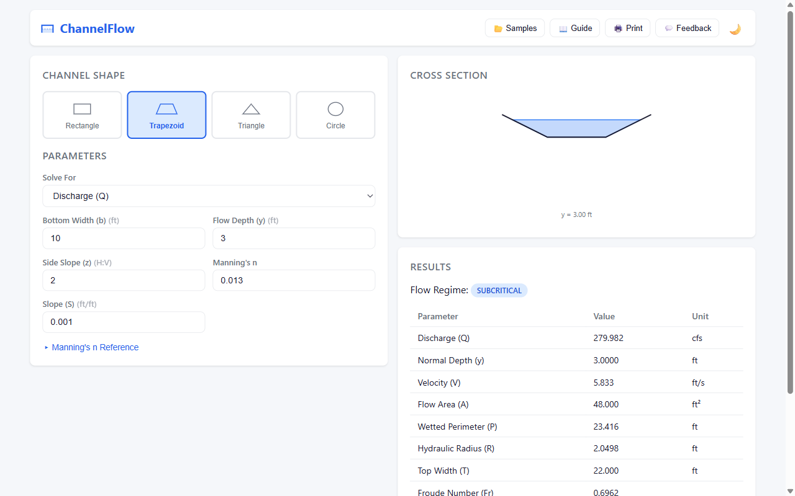

# manningcalc

**Free, browser-based open-channel hydraulics solver — replacing $3K/yr software with Manning's equation in your browser.**



## What It Does

manningcalc solves Manning's equation for open-channel flow. Pick a channel shape, enter the known parameters, and instantly get normal depth, velocity, Froude number, and flow classification — with a live cross-section diagram.

## Features

- **4 cross-section shapes** — Rectangle, Trapezoid, Circle, Triangle
- **Solve for any unknown** — discharge (Q), depth (y), slope (S), roughness (n), or bottom width (b)
- **Live cross-section diagram** — SVG rendering with labeled dimensions and water level
- **Flow classification** — subcritical / critical / supercritical with color-coded badges
- **Manning's n reference table** — 16 common materials with min/typical/max values
- **Printable report** — calculation summary with diagram and results
- **Light & dark theme**

## Quick Start

```bash
# Prerequisites: Node.js ≥ 18, pnpm
pnpm install
pnpm build
pnpm --filter @manningcalc/web dev
# Open http://localhost:5173
```

Run tests:

```bash
pnpm test
```

## Key Equations

### Manning's Equation (US Customary)

```
Q = (1.49 / n) × A × R^(2/3) × S^(1/2)
```

| Symbol | Meaning |
|--------|---------|
| Q | Discharge (cfs) |
| n | Manning's roughness coefficient |
| A | Flow area (ft²) |
| R | Hydraulic radius = A / P (ft) |
| S | Channel slope (ft/ft) |

### Froude Number

```
Fr = V / √(g × A / T)
```

| Fr | Regime |
|----|--------|
| < 1 | Subcritical |
| = 1 | Critical |
| > 1 | Supercritical |

### Critical Depth

```
Q² × T / (g × A³) = 1
```

Solved iteratively for the depth at which flow transitions between subcritical and supercritical.

## Tech Stack

| Layer | Technology |
|-------|-----------|
| Engine | TypeScript — geometry, solver (bisection/Newton), flow classification |
| Web UI | React + Vite — input form, SVG diagram, results table |
| Monorepo | pnpm workspaces |
| Testing | Vitest — validated against Chow & Chaudhry textbook solutions |

## Project Structure

```
manningcalc/
├── packages/
│   ├── engine/              # Pure-TS hydraulics engine
│   │   └── src/
│   │       ├── geometry.ts       # Cross-section area, perimeter, top width
│   │       ├── solver.ts         # Manning's equation solver (iterative)
│   │       ├── classification.ts # Froude number, flow regime, critical depth
│   │       ├── types.ts          # Shape params, ManningInput, FlowResult
│   │       └── __tests__/        # Textbook-validated test suite
│   └── web/                 # React + Vite frontend
│       └── src/
│           ├── components/
│           │   ├── ShapeSelector.tsx       # Visual channel shape picker
│           │   ├── InputForm.tsx           # Dynamic parameter inputs
│           │   ├── CrossSectionDiagram.tsx # Live SVG channel diagram
│           │   ├── ResultsTable.tsx        # Computed results + regime badge
│           │   ├── ManningNTable.tsx       # Roughness coefficient reference
│           │   └── Toolbar.tsx             # Shape, Calculate, Report actions
│           └── App.tsx
├── PLAN.md
├── package.json
└── pnpm-workspace.yaml
```

## License

MIT
